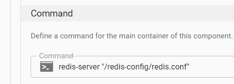

An well designed application is likely to have configurations which vary between deployments. Kubernetes makes it easy to override the configurations specified in images.

## Example Container Setup

Let's go through an example of configuring Redis. Our goal is to change the `maxmemory` parameter. (Imagine that you need a larger amount of memory for production vs dev)

Create a new Application

Create a new Component

Set the image to "redis"

## Container Lifecycle

To understand why configuration should be setup outside the container itself, let's first try something that doesn't work: configure the application right in the container.

Click the _Shell_ icon to open a shell attatched to our redis container. In the shell, enter:

```
redis-cli CONFIG SET maxmemory 2mb
```

Verify the config has been correctly set

```
redis-cli CONFIG GET maxmemory
```

Everything seem to be working. However, let's delete the pod.

Go to **Containers** and click on the **Delete** icon

As soon as the pod is deleted, kubernetes will schedule a new one to be deployed, automatically maintaining the desired state of 1 pod running.

After the new pod is created, click on the **shell icon** next to it.

Check the `maxmemory` setting via

```
redis-cli CONFIG GET maxmemory
```

So what happened to our setting? It was lost when the pod was destroyed and recreated. Since pods and containers are ephemeral, we can't store configuration states within the pod

## Adding a Config File

The correct way to configure containers is via environment variables and configuration files. Redis happen to use config files.

Go to **Components**, click on **Edit**

In the Configuration Files section click **Add**

For Mount Path, type `/redis-config/redis.conf`

Click on the **Edit** Icon

A modal editor will pop up, inside the editor, enter our desired config
of `maxmemory 5mb`


click **OK** (which should really be named Save)

We've just created a config file. Now we need to override the startup command to tell redis to use it.

In the **Command** input box, type `redis-server "/redis-conf/redis.conf"`



Click **Update Deployment**

After the update is complete, open the shell again and type

```
redis-cli CONFIG SET maxmemory
```

Our configuration is picked up, this time via the configuration pod.

Now if we delete the pod again(go ahead and try it), the configuration will still be there.

## Environment Varibles

Other Applications may use environment variables instead of config files. To add an environment variable, click _Add_ in the Environment Variables section of the Edit Component Form:


Click **Update Component** to apply this change

To verify that the Environment Variable has been set, open a shell and type

```
echo $MY_ENV_VAR
```

You should see the value set above(42) as the output
