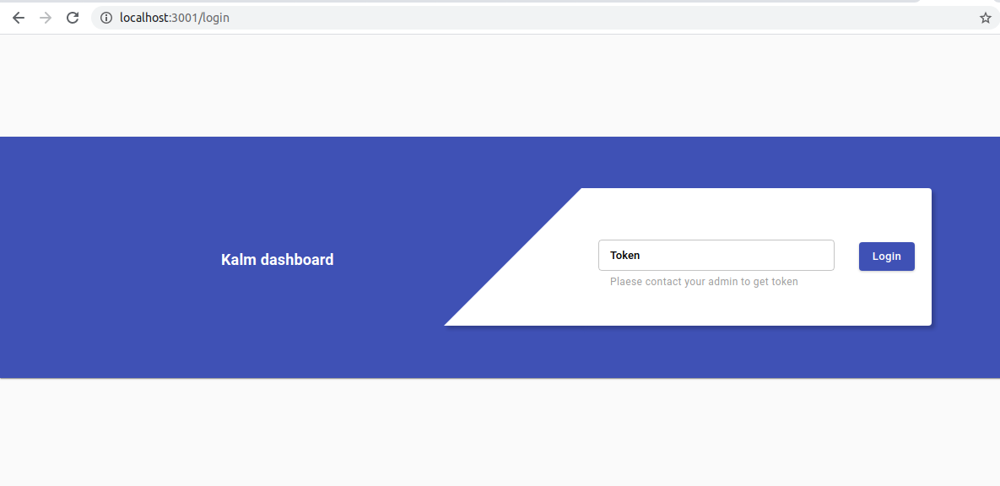

## Compatibility

Kalm is optimized to work with the latest version of Kuberenetes (currently 1.18.x), and is backwards compatible down to 1.14.x

| Kalm version | k8s 1.14.x | k8s 1.15.x | k8s 1.16.x | k8s 1.17.x | k8s 1.18.x |
| ------------ | ---------- | ---------- | ---------- | ---------- | ---------- |
| 0.1.0        | ✔          | ✔          | ✔          | ✔          | ✔          |

<br>

## Step 1: Prerequisites

### Install Kubectl

Installation of Kalm requires kubectl, which can be installed according to the official <a href="https://kubernetes.io/docs/tasks/tools/install-kubectl/" target="_blank">Install and Set Up kubectl</a> docs.

### Cluster Setup (Minikube)

Kalm can be used to manage any kubernetes cluster. For the purpose of this tutorial, we recommend that you <a href="https://kubernetes.io/docs/tasks/tools/install-minikube/" target="_blank">install Minikube<a>, a single-node localhost cluster.

Once minikube is installed, create a new cluster via:

```
minikube start --memory 8192 --cpus 4
```

Alternatively, see the References sections for provisioning clusters on AWS and Google Cloud.

<br>

## Step 2: Install Kalm

Kalm can be installed as a [Kubernetes Operator](https://kubernetes.io/docs/concepts/extend-kubernetes/operator/) directly onto your cluster via:

```sh
curl -sL https://get.kalm.dev | bash
```

This command installs Kalm plus a few dependencies, and can take a few seconds to complete. To check the status of the installation, run:

```sh
curl -sL https://get.kalm.dev/status | bash
```

```sh
NAME                            READY   STATUS    RESTARTS   AGE
kalm-operator-5fcf5d87f-k4h69   2/2     Running   0          21m

NAME                               READY   STATUS    RESTARTS   AGE
kalm-79f76fbf9c-tskck              2/2     Running   0          13m
kalm-controller-694d8d9c78-rn55v   2/2     Running   0          16m

NAME                                       READY   STATUS    RESTARTS   AGE
cert-manager-766d5c494b-lqdfs              1/1     Running   0          20m
cert-manager-cainjector-6649bbb695-gccc7   1/1     Running   0          20m
cert-manager-webhook-68d464c8b-bds28       1/1     Running   0          20m

NAME                                    READY   STATUS    RESTARTS   AGE
istio-ingressgateway-74d4d8d459-thqsz   1/1     Running   0          19m
istiod-5c99cfc846-mx6c5                 1/1     Running   0          20m
prometheus-69d8b457f9-5t5tk             2/2     Running   0          19m
```

If one or more namespaces is showing up as not ready, please wait a few seconds and try again.

_Instructions on installing from source can be found on the Kalm github repository._

<br>

## Step 3: Launch Webserver

To enable browser access, open a port via:

```sh
kubectl port-forward -n kalm-system \
  $(kubectl get pod -n kalm-system \
    -l app=kalm \
    -ojsonpath="{.items[0].metadata.name}") \
  3001:3001
```

Now open <a href="http://localhost:3001/" target="_blank">http://localhost:3001/</a>



Kalm should be running. Next we need to generate a Service Account on the cluster.

## Step 4: Admin Service Account

In order to manage applications, Kalm requires _cluster-admin_ privilages on the cluster. To keep things clean, we recommend creating a <a href="https://kubernetes.io/docs/reference/access-authn-authz/service-accounts-admin/" target="_blank">_Service Acount_</a> for Kalm.

To create a service account with cluster-admin privilages:

```bash
kubectl create sa kalm-admin-user
kubectl create clusterrolebinding \
  kalm-admin-binding \
  --user=system:serviceaccount:default:kalm-admin-user \
  --clusterrole=cluster-admin
```

### Retrieve Token

_Note: the following command utilizes jq, a useful json processor which can be found at [https://stedolan.github.io/jq/](https://stedolan.github.io/jq/)_

To use the service account we've just created, we need to retrieve the token

```
KALM_ADMIN_SECRET=$(kubectl get sa kalm-admin-user -o json | jq -r .secrets\[\].name)
KALM_ADMIN_TOKEN=$(kubectl get secret $KALM_ADMIN_SECRET -o json | jq -r '.data["token"]' | base64 -d)
echo $KALM_ADMIN_TOKEN
```

\
You should see a token similar to:


\
Copy the token, paste it into the input field, and press **Login**


You should see the main page


## Next Step

Congratulations! Kalm is now properly setup and running. Next, let's create our first application to see how Kalm works.
