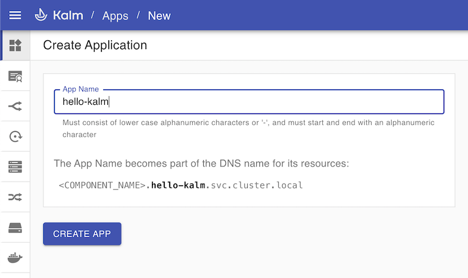
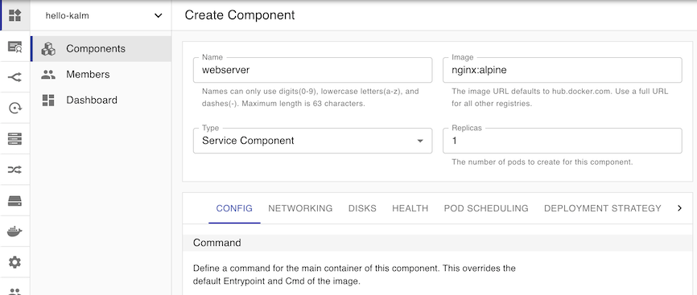
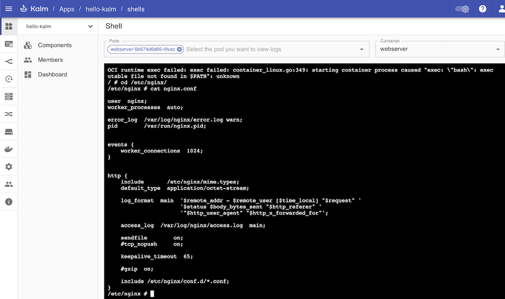
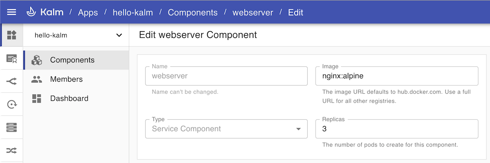
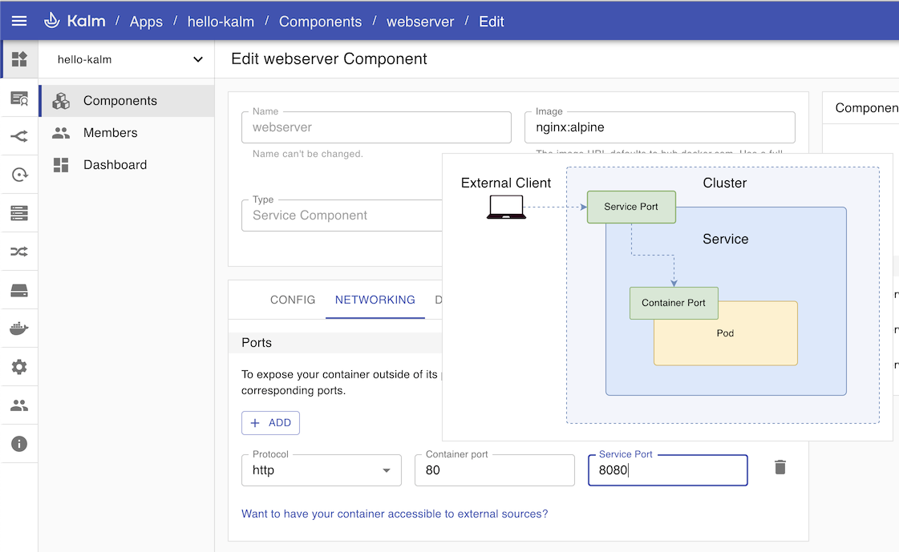

Let's go through a simple example of deploying a single pod holding an nginx container.

This tutorial will teach you:

- The basics of how Kalm organizes deployments into applications
- How to create application configurations
- How to open a port and direct traffic to an application

## Step 1: Create Application

The main page of Kalm shows a list of applications. Press the "Add" Button


Enter a name for your application, such as "hello-kalm".



## Step 2: Create Component

An application contains 1 or more components. Each component typically corresponds to a docker image. In this example, we will create 1 component which holds the official nginx image.

Click the "Add Component" Button. Enter "webserver" into the Name field and "nginx:latest" into the Image field. Leave all other fields as is and click "Deploy".



After a few seconds, a single Pod holding the nginx:latest image is successfully deployed to your cluster.


## Step 3: Examine and Modify Component

Let's examine our pod. Kalm provides a handy terminal for quick examinations into pods. Click the "Shell" Icon to connect a shell to the pod.


Let's run a few commands:

```
cd /etc/nginx
ls
cat nginx.conf
```

It seems that this is the nginx container we wanted



Next let's go back to the Components list, and edit our component.

Currently, a single pod is running on our cluster, because we specified 1 replica when creating the component. We can edit Application components at any time and redeploy it. Click the "Edit" button.


Change the number of replicas to "3" and click Deploy.



After a few moments, there should be three pods running.


You may have heard that kubernetes is "declarative", which means you specify the end result, and the kubernetes control plane figures out how to achieve the end result for you.

## Step 4: Port and HTTP access

Since nginx is a web server, what we really want is to be able to see it via a browser. To enable HTTP access, we have to do two things. First let's open a port on the component. Click "Edit" on the webserver component, then click on the "Networking" tab.


To open a port, lets specify two values, the "Container Port" and the "Service Port". Kalm tries to be helpful by providing visual reminders. The Container port should be 80 because thats what the nginx:latest image defaults to. TheService port can be an arbitrary port such as 8080.



Click Deploy to update the deployment.

During the deployment you may notice that the number of pods temporarily exceeds three. By default, Kalm uses a rolling update, which means pods are incrementally added and removed one by one, resulting in zero downtime.


Now that the port is open, let's specify a route. Click the "Routes" tab, then click "Add"


In the Routes section, let's enter "\*" for host, which allows us to visit directly via the IP.


Next open the targets selector, choose our component.


Click "Save Route", and a route will have been added. Mouse over "routes" and click on Open in browser.


You should see a new tab with a "Welcome to nginx!" screen:


Congratulations, you've just deployed an application with an image, scaled it, edited, and setup routing so it can be visited from the outside world.

In the next tutorial we'll cover setting up multiple components working together, representing a real world "microservices" architecture.
