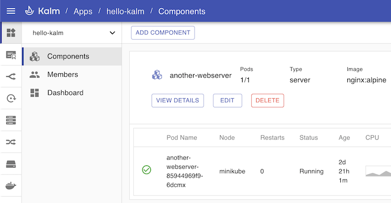
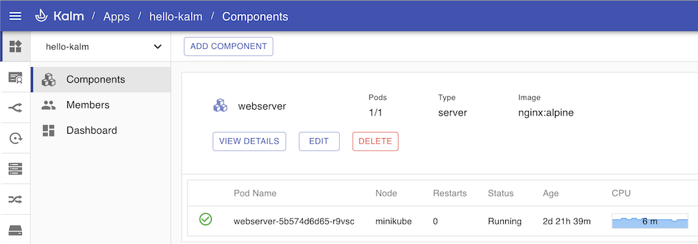
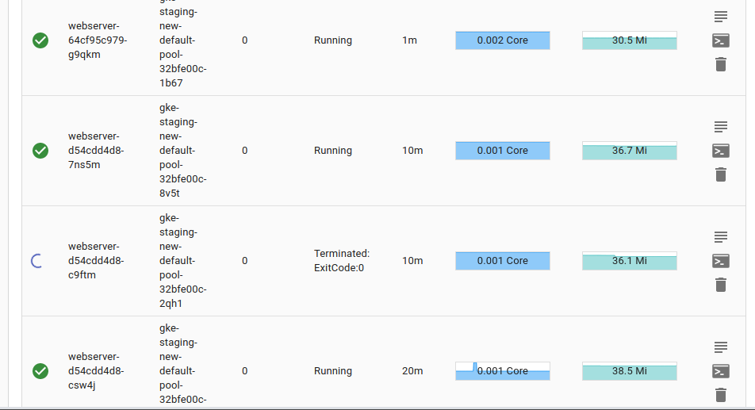
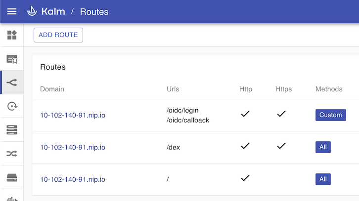
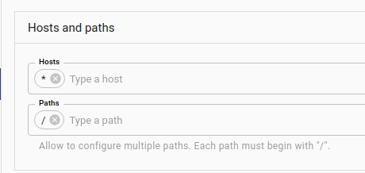
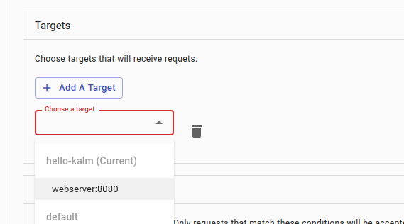
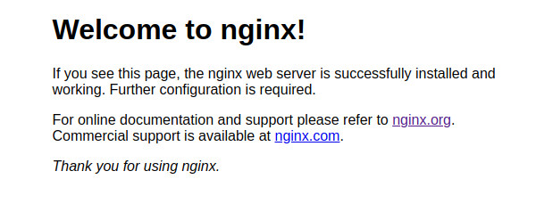

Let's go through a simple example of deploying a single pod holding an nginx container.

This tutorial will teach you:

- The basics of how Kalm organizes deployments into applications
- How to create application configurations
- How to open a port and direct traffic to an application


<figure class="video_container">
  <iframe width="560" height="315" src="https://www.youtube.com/embed/fzig4AvMr74" frameborder="0" allowfullscreen="true"> </iframe>
</figure>


## Step 1: Create Application

The main page of Kalm shows a list of applications. Press the **Add Application** button


Enter a name for your application, then press **Create Application**


<br>

## Step 2: Create Component

An application is made of one or more _components_. Each component typically holds a docker image. In this example, we will create a component which contains the official <a href="https://hub.docker.com/_/nginx" target="_blank">nginx image</a>

Under the Basic Information section, enter a name such as _"webserver"_ into the **Name** field and **_nginx:latest_** into the **Image** field. Leave all other fields as is and click **Deploy Component**.


After a few seconds, a single Pod holding the nginx:latest image will be deployed to your cluster.



<br>

## Step 3: Examining and Updating

Let's examine our pod to see if nginx is really deployed. Kalm provides a handy terminal for quick examinations. Open a shell to our pod by clicking on the shell icon.


Run a few commands, for example:

```
cd /etc/nginx
ls
cat nginx.conf
```

It seems that nginx is correctly installed!


Next let's go back to the Components list by clicking on **Components** in the navigation sidebar.

Currently one pod is running. Let's scale up our application. Click the **Edit** button.



Change the number of replicas to **3** and click Deploy.


After a few moments, there should be three pods running.


Kubernetes is declarative, which means you specify the end result("I want 3 pods"), and the kubernetes control plane figures out how best to achieve the end result for you("let's add 2 more").

## Step 4: Ports and Routing

Let's make our application accessible in the browser. We can do this by opening a port on our component, then adding a route to it.

First we'll open a port. Once again, we'll go the components area and click on **Edit**, then click on the **Networking** tab.


To open a port, we need to specify a `Container Port` and a `Service Port`. Kalm tries to be helpful by providing a visual reminder of which is which.

The Container port should be **80** because its what the `nginx:latest` image defaults to. The Service port can be an arbitrary port of your choosing, such as **8080**.


Click **Deploy** to apply changes.

_Note: During the deployment you may notice that the number of pods temporarily exceeds three. Kalm by default uses `rolling update`, which means pods are incrementally added and removed one by one, resulting in zero downtime._



<br>

Now that the port is open, let's add a route. Click **Routes** in the navigation sidebar tab, then click **Add Route**



Let's enter "\*" for host, which allows us to visit directly via IP address.



In the _Targets_ section, select our _"webserver"_ component from the dropdown.



Click **Update Route**. Our route is now completely setup.

Click **Open in Browser** to check it out.


Great, our application is working!



You've just installed an application on your cluster, modified it, scaled it, and setup routing to make it accessible from the outside world!

All the heavy lifting is done via kubernetes and istio. Kalm is simply applying the appropriate configurations to your cluster. In fact anyone with familiarity with kubernetes should be able to create the same application configuration with a text editor and `kubectl`. We encourage this as an _exercise for the reader_.

## Next Step

Admittedly our "application" is rather trivial. In the next tutorial, let's go over a more representative application containing multiple microservices working together.
