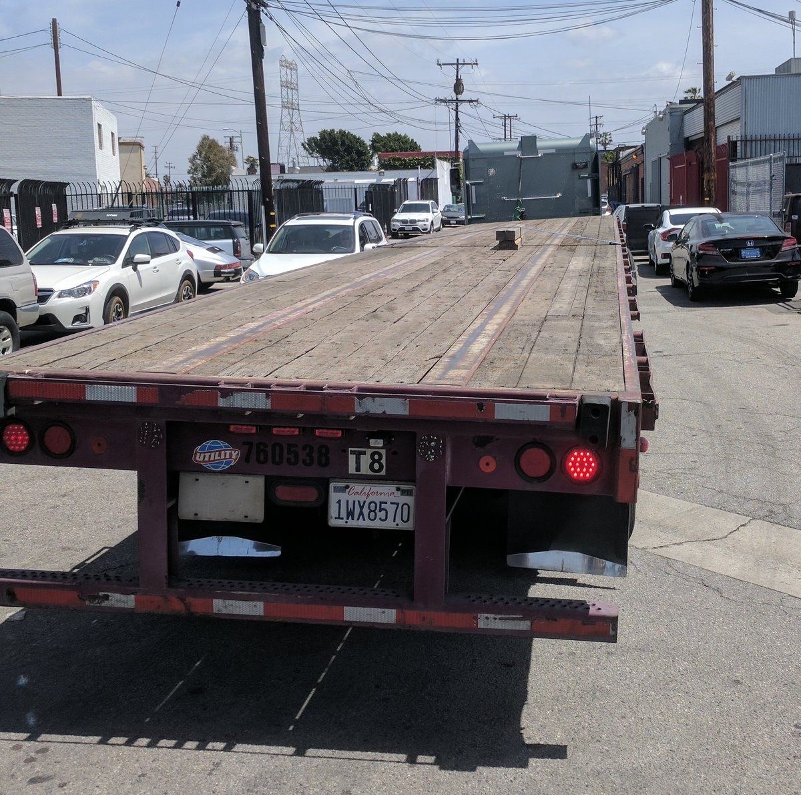
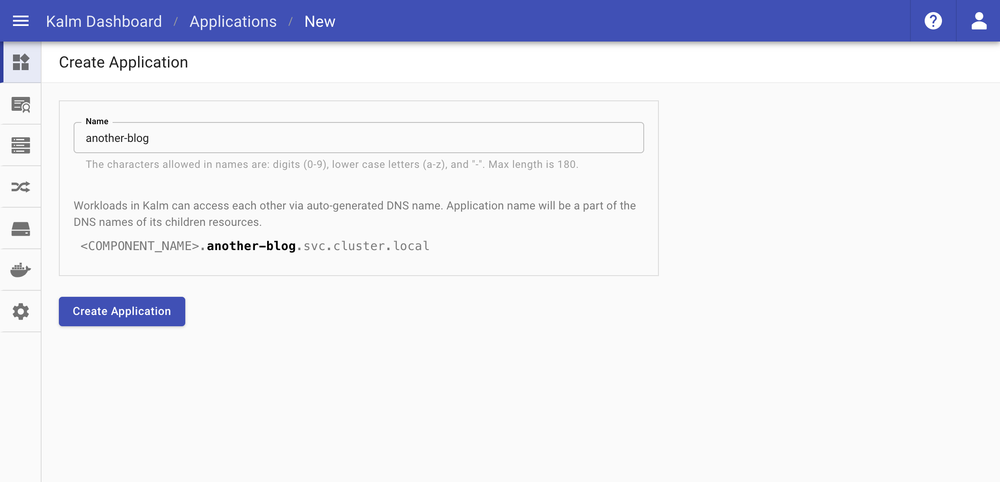
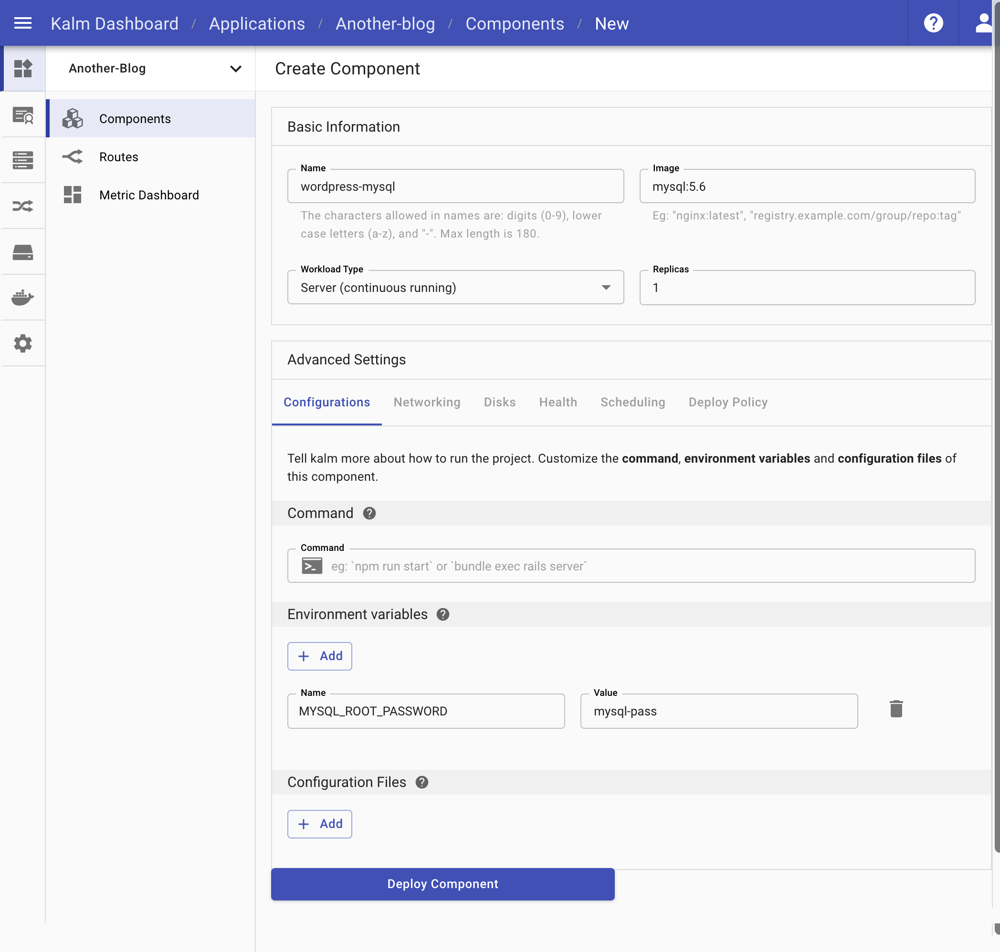
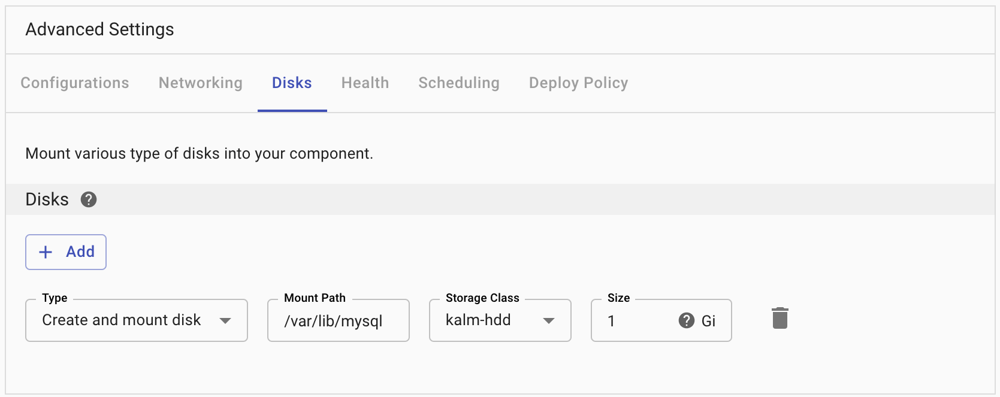
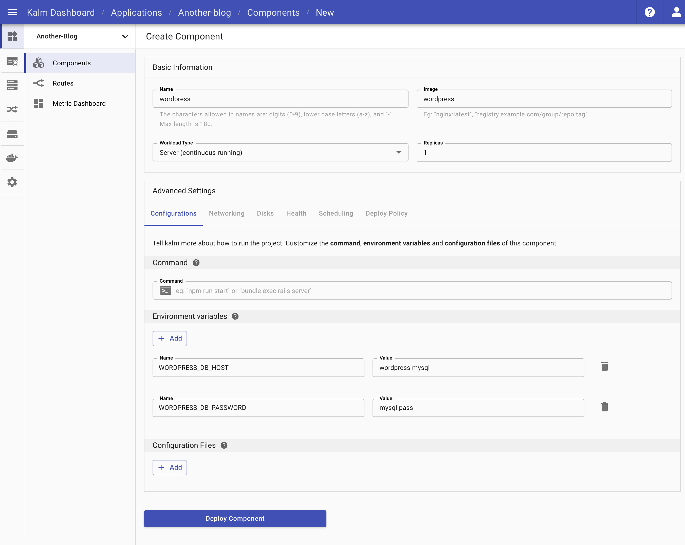
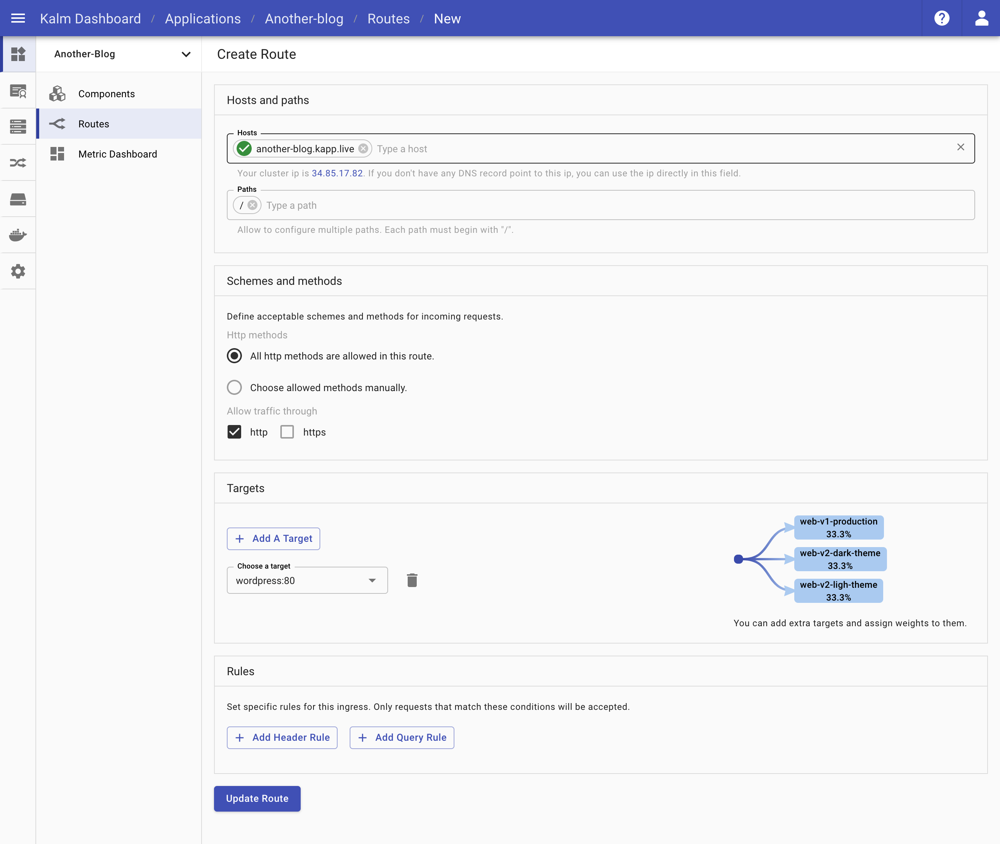

When you try to run a wordpress with kubernetes,it's just like you drive a gaint truck was loaded with only one brick. There are lots of concepts and bunch of config files you need to know and handle. But now, you can easy with kalm, let's install just another wordpress site in 3 minutes!

## Create New Application

- open [dashboard](https://dashboard.kapp.live/applications/new) and enter application name
- we use `another-blog` in this tutorial

## Add Database Component

### Basic Information

- name: `wordpress-mysql`
- image: `mysql:5.6`

### Configurations

- environment variables
  - `MYSQL_ROOT_PASSWORD` : `mysql-pass`

### Networking

- Expose ports to cluster
  - Name : `mysql`
  - Container Port : `3306`

### Disks

- Add Disks
  - Click `+ Add`
  - Type : `Create and mount disk`
  - Mount path : `/var/lib/mysql`
  - Storage class : `Kalm-HDD`
  - Size : `1Gi`

Database will be done soon, let's go on next step.

## Add Wordpress Component

### Basic Information

- name: `wordpress`
- image: `wordpress`

### Configurations

- environment variables
  - `MYSQL_ROOT_HOST` : `wordpress-mysql`
  - `MYSQL_ROOT_PASSWORD` : `mysql-pass`

### Networking

- Expose ports to cluster
  - Name : `http`
  - Container Port : `80`

### Disks

- Add Disks
  - Click `+ Add`
  - Type : `Create and mount disk`
  - Mount path : `/var/www/html`
  - Storage class : `Kalm-HDD`
  - Size : `1Gi`

## Add Route

- open [Routes](https://dashboard.kapp.live/applications/another-blog/routes/new) and click `Add New Route`
  - Hosts : using your own domain or just click ingress ip quick action which under the input field.
  - Targets: select `wordpress:80` on dropdown menu from `choose a target`
  - click `Add Route`

## Rock it!

After a few seconds, you can see all components work well, the badge should be green.

then you can open and play with your another wordpress site!

