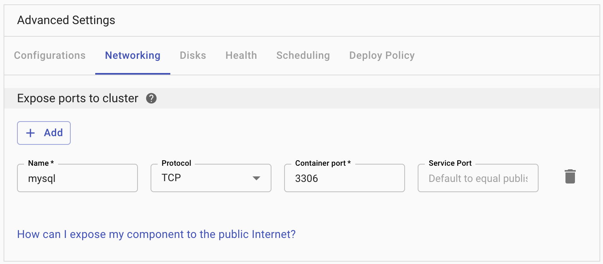
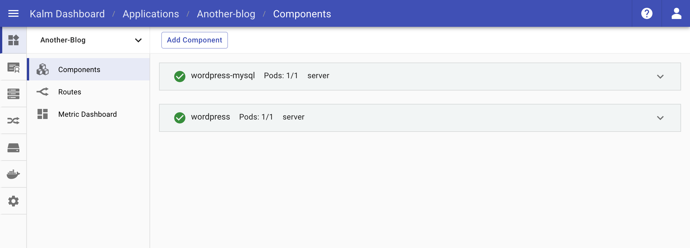
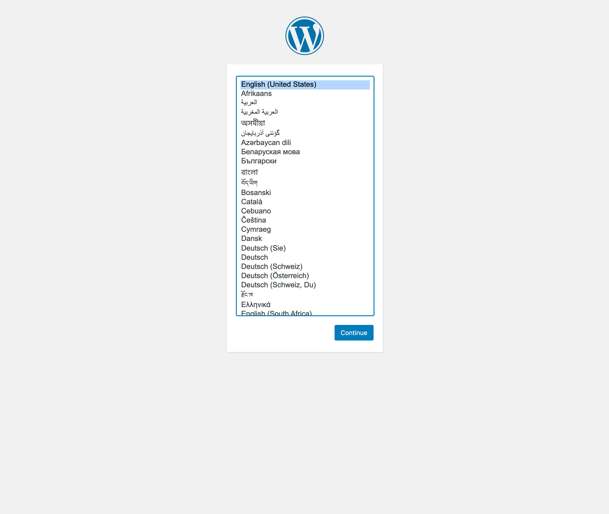

While some believe that running a WordPress site with Kubernetes is a little like driving a giant truck loaded with only one brick, it's actually rather simple to setup with Kalm. Let's install the "Just Another WordPress Site" in 3 minutes!

## Create New Application

The first thing we need is a new Application for the two components that make up our WordPress site.

- In your Kalm application dashbord, click *Create App* and enter your application's name

We used the name `another-blog` for this tutorial.

## Add The Database Component

Once you create the application, you'll be prompted to add a component to it. We'll start by adding our Database Component.

- For the component *Name*, enter `wordpress-mysql`
- For the component *Image*, enter `mysql:5.6`

### Configurations

Next we'll move into the *Config* tab.

- Under Environment Variables, click *+ New Variable*
  - For the *Name*, enter `MYSQL_ROOT_PASSWORD`
  - For the *Value*, enter `mysql-pass`

### Networking

Now we'll expose a Container Port to the cluster so we can access this image. Click the *Networking* tab.

- Under Ports, click *+ ADD*
  - For the *Protocol*, keep the default `http`
  - For the *Container Port*, enter `3306`
  - You can keep the *Service Port* blank

### Disks

Lastly, we'll add some storage for this image. Click on the *Disks* tab.

- Under Disks, click *+ Add*
  - For the *Type*, keep the default `Create and mount disk`
  - For the *Mount Path*, enter `/var/lib/mysql`
  - For the *Storage Class*, keep the default `kalm-hdd`
  - For the *Size*, enter `1Gi`

Click *Deploy Component* and our pod will start spinning up. While this is deploying, we'll setup our second component.

## Add The Wordpress Component

To add our second component, we'll click *Add Component* from the Application Components page.

- For the component *Name*, enter `wordpress`
- For the component *Image*, also enter `wordpress`

### Configurations

Once again we'll move to the *Config* tab. This time we're adding two Environment Variables.

- Under Environment Variables, click *+ New Variable*
  - For the *Name*, enter `MYSQL_ROOT_HOST`
  - For the *Value*, enter `wordpress-mysql`
- Click *+ New Variable* again to add a second Environment Variable
  - For the *Name*, enter `MYSQL_ROOT_PASSWORD`
  - For the *Value*, enter `mysql-pass`

### Networking

Once again we'll click the *Networking* tab and expose a container port to the cluster.

- Under Ports click *+ ADD*
  - For the *Protocol*, keep the default `http`
  - For the *Container Port*, enter `80`
  - You can keep the *Service Port* blank again

### Disks

Again we'll click the *Disks* tab to add storage for this component.

- Under Disks, click *+ Add*
  - For the *Type*, keep the default `Create and mount disk`
  - For the *Mount Path*, enter `/var/www/html`
  - For the *Storage Class*, keep the default `kalm-hdd`
  - For the *Size*, enter `1Gi`

## Add Route

Lastly, we need to open a Route for our WordPress component so we can access it via a web browser. Click the *Routes* tab on the left navigation menu.

- Click `Add Route`
  - For *Hosts*, you can either use your own domain or just click the ingress ip quick action (the cluster IP under the Hosts input field)
  - For Targets, click the *Choose a target* dropdown and select your `wordpress:80` component from the menu.
  - You can leave all of the other options as their defaults
  - Click `Create Route` to create your route

## Rock it!

After a few seconds, all of the components should be up and running and there should be a green checkmark next to your new route.

You can click the domain to open up and play with your new WordPress site!

